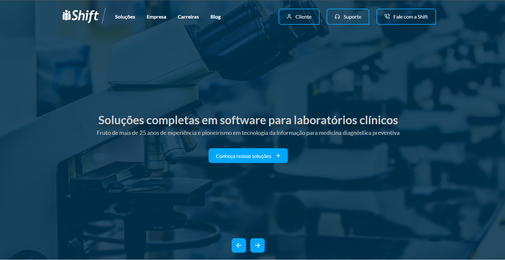

<h1 align="center">
  
  
   

  Shift Company Redesign
</h1>

  &nbsp;&nbsp;
  &nbsp;&nbsp;
  &nbsp;&nbsp;
  
  

<h4 align="center">Um projeto desenvolvido com o intuito de criar um novo design para o website da empresa Shift.
</h4>

 

  <a href="#rocket-tecnologias">Tecnologias</a>&nbsp;&nbsp;&nbsp;|&nbsp;&nbsp;&nbsp;
  <a href="#memo-licença">Licença</a>

  

  <a href="https://shift-redesign.netlify.app/" target="_blank">
     
    
  </a>

 

## :rocket: Tecnologias

Esse projeto foi desenvolvido com as seguintes tecnologias:

- [React](https://reactjs.org)
- [React Router DOM](https://www.npmjs.com/package/react-router-dom)
- [React Intersection Observer](https://github.com/thebuilder/react-intersection-observer#readme)
- [@react-hook/window-size](https://www.npmjs.com/package/@react-hook/window-size)
- [Styled Components](https://github.com/styled-components/styled-components)
- [Framer Motion](https://github.com/framer/motion)
- [Popmotion](https://github.com/popmotion/popmotion)
- [Visual Studio Code](vscode) junto com [Editor Config](vceditconfig), [ESLint](vceslint) e [Prettier]()

[vscode]: https://code.visualstudio.com/
[vceditconfig]: https://marketplace.visualstudio.com/items?itemName=EditorConfig.EditorConfig
[vceslint]: https://marketplace.visualstudio.com/items?itemName=dbaeumer.vscode-eslint
[vcprettier]: https://marketplace.visualstudio.com/items?itemName=esbenp.prettier-vscode

 

## :memo: Licença

Este projeto está sob a licença do MIT. Consulte a [LICENÇA](https://github.com/lemuelzara/shift-company/blob/main/LICENSE) para obter mais informações.

 

---

 

Feito com amor ♥ por Lemuel Coelho Zara :wave: [Bora trocar uma ideia?](https://linkedin.com/in/lemuelzara)